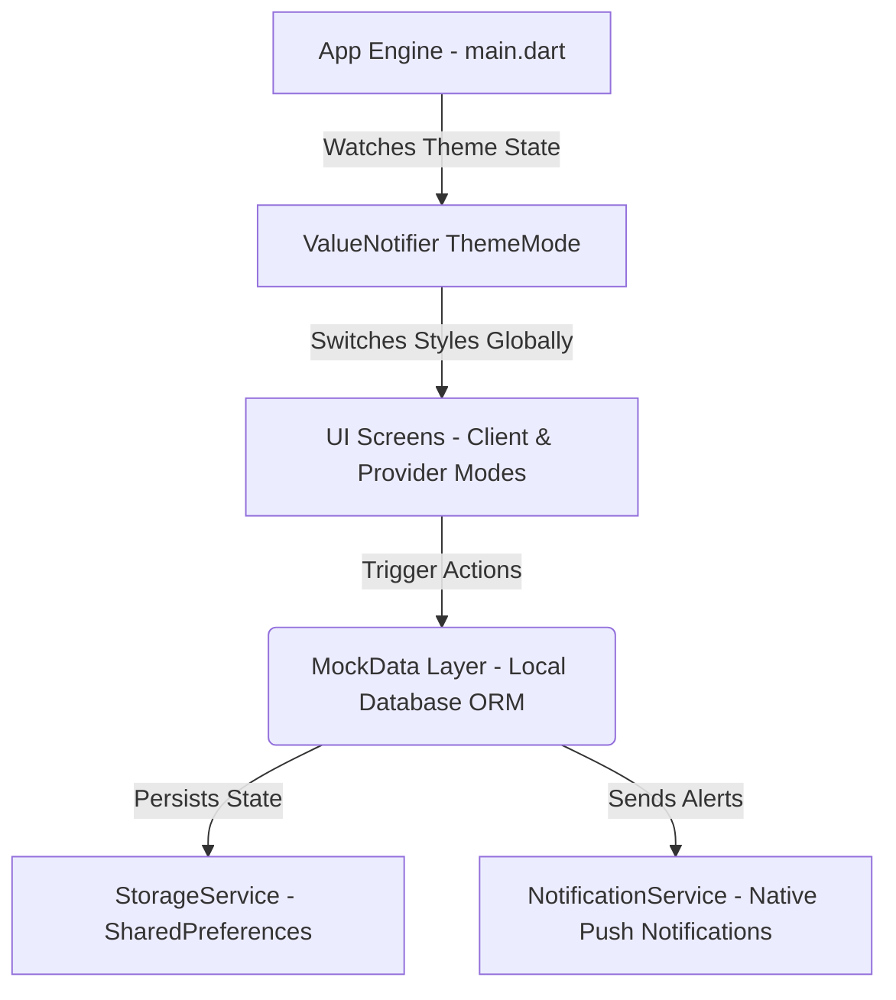
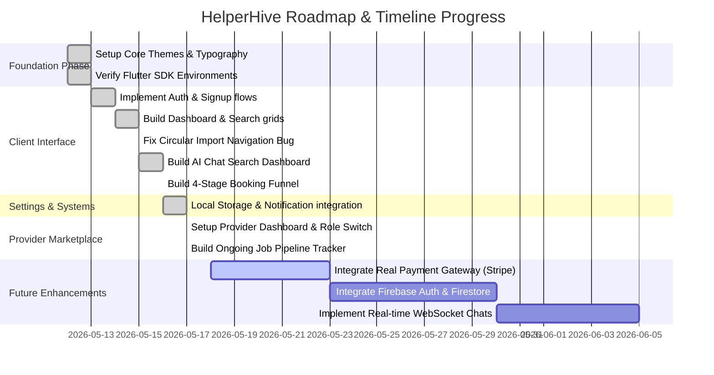

# HelperHive — Comprehensive Project Summary, Log & Implementation Plan
> A complete hand-off, log, and architectural overview detailing the development journey, completed milestones, page catalog, and implementation plan for the HelperHive marketplace application.

---

## 1. PROJECT OVERVIEW & ARCHITECTURE
**HelperHive** is a premium, double-sided, on-demand home services marketplace application built with Flutter. It supports running on Android, iOS, Windows, and Web. The platform seamlessly bridges the gap between clients seeking professional services (cleaners, handymen, painters, plumbers) and local independent service providers.

### Core Architecture & State Synchronization
The application implements a clean, layered architecture to maintain high visual responsiveness, theme synchronization, role switches, and local data persistence:



1. **`MockData` (Local ORM Database)**: Acts as our local database. It seeds initially and keeps lists of `ServiceProvider` instances, active `Booking` objects, `AppNotification` lists, notification settings, and user details in sync. It features data mutation triggers that automatically update the local storage.
2. **`StorageService` (Key-Value Persistence)**: Uses `shared_preferences` to persist data on the device across restarts. This handles user profiles, theme choices (Dark/Light mode toggles), onboarding complete markers, current roles, and active bookings as JSON payloads.
3. **`NotificationService` (System-Level Push)**: Interfaces with `flutter_local_notifications`. On start, it requests permissions dynamically, sets up notification channels, and pushes native notifications directly onto the operating system for booking confirmations and upcoming job reminders.

---

## 2. THE DEVELOPMENT LOG: WHAT WE COMPLETED & HOW
The project has evolved significantly beyond the initial `newchat_context.md` roadmap. Here is the log of major fixes and system enhancements implemented:

### 🛠️ Key Milestones & Critical Bug Fixes
* **Resolved Critical Search Card Navigation Bug**: 
  * *The Problem*: In the original code, tapping a provider card in the `SearchResultsScreen` did not open the `ServiceDetailScreen` due to silent compiler locks caused by a circular import (the detail screen imported the search screen to read the `ServiceProvider` model class, while the search screen imported the detail screen for navigation).
  * *The Fix*: Refactored `ServiceProvider` into its own standalone file at [service_provider.dart](file:///c:/Users/lenovo/Desktop/google/sync_app/lib/models/service_provider.dart). Both screens were updated to import this separate model. Tap response conflicts were resolved, making the entire search result flow fully interactive.
* **Engineered dual Client/Provider Ecosystem**:
  * Added a dynamic role switcher under the Profile tab that toggles the root navigation from the standard **Client View** to a dedicated **Professional Mode Dashboard**.
* **Developed the AI-Powered "Natural Language" Dashboard**:
  * Built a chat interface (`dashboardScreen2.dart`) that replaces rigid grids with a conversational workflow. It parses user intent, runs an orchestration timeline simulation, and maps physical pins onto an interactive mockup radar to discover matching nearby service providers.
* **Built a Fully Functional 4-Stage Booking Funnel**:
  * Implemented an end-to-end booking flow that takes the client from a service provider's detail screen, guides them through slot scheduling, service details input, invoice summaries, and outputs a success confirmation.
* **Created a Robust Professional Dashboard & Active Job step-tracker**:
  * Developed tools for service providers to manage their incoming bookings in real-time, toggle online/offline availability, and track ongoing active jobs through a step-by-step pipeline.
* **Native System-Level Reminders**:
  * Integrated local native notifications to issue alerts on the customer and provider's OS when appointment reminders are clicked.

---

## 3. COMPREHENSIVE LIST OF PAGES (30 SCREENS)
Below is the directory mapping and breakdown of all pages built in `lib/screens/`.

### 🔐 Shared & Authentication Screens (9 Screens)

#### 1. [splash_screen.dart](file:///c:/Users/lenovo/Desktop/google/sync_app/lib/screens/splash_screen.dart)
* **Purpose**: Serves as the application bootstrapper.
* **Aesthetics & Details**: Shows the core brand logo in a green gradient center. It runs a `Timer` for 3 seconds, initializes mock databases, and pushes the navigation stack to either onboarding or the login screen.

#### 2. [onboarding_screen.dart](file:///c:/Users/lenovo/Desktop/google/sync_app/lib/screens/onboarding_screen.dart)
* **Purpose**: Welcomes new users and demonstrates app benefits.
* **Aesthetics & Details**: Utilizes a 3-page horizontal `PageView`. Renders custom graphic illustrations, a dynamic three-dot `PageIndicator` widget, and a circular progress button that counts up and triggers navigation upon completion.

#### 3. [login_screen.dart](file:///c:/Users/lenovo/Desktop/google/sync_app/lib/screens/login_screen.dart)
* **Purpose**: First-level gateway for existing or returning users.
* **Aesthetics & Details**: Sleek layout showing brand name and tagline. Displays custom Apple and Google full-width sign-in buttons alongside a clear option to continue via email.

#### 4. [email_login_screen.dart](file:///c:/Users/lenovo/Desktop/google/sync_app/lib/screens/email_login_screen.dart)
* **Purpose**: Detailed email sign-in.
* **Aesthetics & Details**: Uses customized `CustomTextField` inputs for standard email and passwords. Features a "Remember me" switch, a password recovery link, standard Google/Apple circular secondary options, and an entry to navigate to signup.

#### 5. [signup_screen.dart](file:///c:/Users/lenovo/Desktop/google/sync_app/lib/screens/signup_screen.dart)
* **Purpose**: Registers a new customer.
* **Aesthetics & Details**: Forms to gather full name, email address, password, and agree to service terms. Navigates forward into the OTP verification flow on form submission.

#### 6. [otp_verification_screen.dart](file:///c:/Users/lenovo/Desktop/google/sync_app/lib/screens/otp_verification_screen.dart)
* **Purpose**: Confirms email authenticity or forgot-password security keys.
* **Aesthetics & Details**: Renders four customized auto-focusing numeric entry boxes. Accepts an `isFromSignup` parameter:
  * `isFromSignup == true`: Confirms account setup, pops up a success registration dialog, and moves back to login.
  * `isFromSignup == false`: Verifies reset security codes and routes to the password update screen.

#### 7. [reset_password_screen.dart](file:///c:/Users/lenovo/Desktop/google/sync_app/lib/screens/reset_password_screen.dart)
* **Purpose**: Allows users to recover locked accounts.
* **Aesthetics & Details**: Minimalistic screen prompting the user for their registered email address, sending an automated OTP code upon confirmation.

#### 8. [create_new_password_screen.dart](file:///c:/Users/lenovo/Desktop/google/sync_app/lib/screens/create_new_password_screen.dart)
* **Purpose**: Sets a new account password.
* **Aesthetics & Details**: Renders password entry fields with real-time length criteria checks. Shows a success modal when updated before returning the user to the login screen.

#### 9. [address_setup_screen.dart](file:///c:/Users/lenovo/Desktop/google/sync_app/lib/screens/address_setup_screen.dart)
* **Purpose**: Prompts newly registered users to set up a home address.
* **Aesthetics & Details**: Emulates permission access dynamically inside `initState`. Displays a split screen with a decorative mock vector map on the top half and a white rounded location selection card with prefilled values on the bottom.

---

### 📱 Client-Side & Core Navigation Screens (11 Screens)

#### 10. [main_navigation_screen.dart](file:///c:/Users/lenovo/Desktop/google/sync_app/lib/screens/main_navigation_screen.dart)
* **Purpose**: Root shell for standard user activities.
* **Aesthetics & Details**: Implements a sleek, floating, pill-shaped bottom navigation bar with rounded corners. It manages five central pages inside an `IndexedStack` (Home/Search, Bookings, Calendar, Inbox, Profile) and features a dynamic floating toggle to switch the home screen between the Classic and AI View dashboards.

#### 11. [home_dashboard_screen.dart](file:///c:/Users/lenovo/Desktop/google/sync_app/lib/screens/home_dashboard_screen.dart)
* **Purpose**: The "Classic" home page.
* **Aesthetics & Details**: Renders a header with a personalized greeting, user avatar, location selection, dynamic notification bell, search shortcut, a green horizontal promotion banner, an 8-category grid of services (Cleaning, Repairing, Painting, Laundry, Appliance, Plumbing, Shifting, More), and a list of popular providers.

#### 12. [dashboardScreen2.dart](file:///c:/Users/lenovo/Desktop/google/sync_app/lib/screens/dashboardScreen2.dart) (AI Search Dashboard)
* **Purpose**: AI-powered natural language search dashboard.
* **Aesthetics & Details**: Displays a message thread interface. Clients can type requests in plain English (e.g. *"I need someone to clean my apartment"*). The app runs an AI orchestration phase, renders a dynamic progress checklist, displays a live map containing active nearby provider pins, and renders top matching provider cards that link directly to detailed service pages.

#### 13. [search_results_screen.dart](file:///c:/Users/lenovo/Desktop/google/sync_app/lib/screens/search_results_screen.dart)
* **Purpose**: Detailed list of search results.
* **Aesthetics & Details**: Features a standard search bar with auto-clear, service filters (All, Cleaning, Laundry, etc.), and lists matching provider cards with star rating icons, pricing scales, distance info, and navigation to details (now fully operational after fixing the circular import).

#### 14. [service_detail_screen.dart](file:///c:/Users/lenovo/Desktop/google/sync_app/lib/screens/service_detail_screen.dart)
* **Purpose**: Displays full business profiles of service providers.
* **Aesthetics & Details**: Implements a collapsing `SliverAppBar` with hero imagery, rating cards, dynamic tabs (About, Photos, Reviews), expandable long description texts, image galleries, and a sticky bottom CTA containing direct chat links and a prominent "Book Now" green button.

#### 15. [address_selection_screen.dart](file:///c:/Users/lenovo/Desktop/google/sync_app/lib/screens/address_selection_screen.dart)
* **Purpose**: Manage saved home or office locations.
* **Aesthetics & Details**: Displays lists of configured home, work, or temporary addresses with edit/delete icons and an option to drop new pins.

#### 16. [add_address_map_screen.dart](file:///c:/Users/lenovo/Desktop/google/sync_app/lib/screens/add_address_map_screen.dart)
* **Purpose**: Interactive coordinate mapping picker.
* **Aesthetics & Details**: Displays a full map view simulation with custom layout options (Apple Style, Dark AI, Google Maps, Soft Green). Allows dragging pins, searching locations, and saving configurations.

#### 17. [booking_date_screen.dart](file:///c:/Users/lenovo/Desktop/google/sync_app/lib/screens/booking_date_screen.dart)
* **Purpose**: First stage of the booking flow (scheduling).
* **Aesthetics & Details**: Features a calendar view to select booking days and a horizontal grid to pick convenient time slots (Morning/Afternoon/Evening).

#### 18. [booking_details_screen.dart](file:///c:/Users/lenovo/Desktop/google/sync_app/lib/screens/booking_details_screen.dart)
* **Purpose**: Second stage of the booking flow (requirements).
* **Aesthetics & Details**: Prompts the user for specific instructions, job descriptions, photo attachments, and preferred payment methods (Cash, Card, Wallet).

#### 19. [booking_summary_screen.dart](file:///c:/Users/lenovo/Desktop/google/sync_app/lib/screens/booking_summary_screen.dart)
* **Purpose**: Third stage of the booking flow (invoice confirmation).
* **Aesthetics & Details**: Displays an itemized bill showing base charges, transport fees, service taxes, and the total cost. Renders selected dates and provider cards before final checkout.

#### 20. [booking_success_screen.dart](file:///c:/Users/lenovo/Desktop/google/sync_app/lib/screens/booking_success_screen.dart)
* **Purpose**: Confirms the booking.
* **Aesthetics & Details**: Displays a celebratory success checkmark animation, lists booking IDs, and offers direct navigation links to view schedules or return to the main dashboard.

---

### ⚙️ User Settings & Personalization Screens (5 Screens)

#### 21. [profile_screen.dart](file:///c:/Users/lenovo/Desktop/google/sync_app/lib/screens/profile_screen.dart)
* **Purpose**: Configures client profile, stats, and settings.
* **Aesthetics & Details**: Renders user profile picture, name, and email. Features a dynamic booking stats card (Upcoming/Completed/Reviews), dark mode toggle synced with storage, role switcher button, and a customized logout pop-up.

#### 22. [edit_profile_screen.dart](file:///c:/Users/lenovo/Desktop/google/sync_app/lib/screens/edit_profile_screen.dart)
* **Purpose**: Modifies personal registration details.
* **Aesthetics & Details**: Standard inputs for name, email, phone number, and password, integrated with save actions that update the local database.

#### 23. [notification_settings_screen.dart](file:///c:/Users/lenovo/Desktop/google/sync_app/lib/screens/notification_settings_screen.dart)
* **Purpose**: Configures application alert preferences.
* **Aesthetics & Details**: List of toggle switches (General, App Updates, Reminders, Payment, Discounts, Promotions) that save states to `StorageService` immediately on state change.

#### 24. [security_settings_screen.dart](file:///c:/Users/lenovo/Desktop/google/sync_app/lib/screens/security_settings_screen.dart)
* **Purpose**: Configure account verification settings.
* **Aesthetics & Details**: Toggle switches for Face ID, biometric logins, code updates, and Google account linking.

#### 25. [calendar_screen.dart](file:///c:/Users/lenovo/Desktop/google/sync_app/lib/screens/calendar_screen.dart)
* **Purpose**: Renders the user's booking schedule in a calendar format.
* **Aesthetics & Details**: Combines a calendar widget displaying highlighted booking days with a detailed agenda card view below it.

---

### 💬 Messaging & Communication Screens (4 Screens)

#### 26. [inbox_screen.dart](file:///c:/Users/lenovo/Desktop/google/sync_app/lib/screens/inbox_screen.dart)
* **Purpose**: Lists active chat threads.
* **Aesthetics & Details**: Groups ongoing chats by category, shows read/unread badges, lists latest message snippets, and provides search filters.

#### 27. [chat_detail_screen.dart](file:///c:/Users/lenovo/Desktop/google/sync_app/lib/screens/chat_detail_screen.dart)
* **Purpose**: Inside a conversation thread.
* **Aesthetics & Details**: Implements high-fidelity user/provider text bubbles, online indicators in the header, call shortcuts, and an expandable text composition bar with attachment and voice recording triggers.

#### 28. [call_screen.dart](file:///c:/Users/lenovo/Desktop/google/sync_app/lib/screens/call_screen.dart)
* **Purpose**: Full-screen audio call mockup.
* **Aesthetics & Details**: Displays provider avatar, blur backdrop, call duration ticker, and rounded buttons to mute, speakerphone, or hang up.

#### 29. [notifications_screen.dart](file:///c:/Users/lenovo/Desktop/google/sync_app/lib/screens/notifications_screen.dart)
* **Purpose**: Lists general application notifications.
* **Aesthetics & Details**: Features "All" and "Unread" tabs that display categorized alerts with custom icons and date/time stamps.

---

### 🛠️ Provider-Side Suite Screens (6 Screens under `lib/screens/provider/`)

#### 30. [provider_navigation_screen.dart](file:///c:/Users/lenovo/Desktop/google/sync_app/lib/screens/provider/provider_navigation_screen.dart)
* **Purpose**: Base shell for the professional mode.
* **Aesthetics & Details**: Configures standard pages (Dashboard, History, Inbox, Profile) inside an `IndexedStack` with a primary color bottom navigation bar.

#### 31. [provider_setup_screen.dart](file:///c:/Users/lenovo/Desktop/google/sync_app/lib/screens/provider/provider_setup_screen.dart)
* **Purpose**: Registers a client as a service provider.
* **Aesthetics & Details**: Form steps to submit business name, select services category, enter pricing scale, and save details to update `isUserRegisteredAsProvider` inside the local database.

#### 32. [provider_dashboard_screen.dart](file:///c:/Users/lenovo/Desktop/google/sync_app/item/../lib/screens/provider/provider_dashboard_screen.dart)
* **Purpose**: Central hub for service providers.
* **Aesthetics & Details**: Features a professional banner showing total earnings and bookings. Renders a toggle switch for online status, lists incoming job requests with Accept/Decline actions, displays today's schedule, and shows recent history cards.

#### 33. [provider_storefront_screen.dart](file:///c:/Users/lenovo/Desktop/google/sync_app/lib/screens/provider/provider_storefront_screen.dart)
* **Purpose**: Public storefront preview for providers.
* **Aesthetics & Details**: Collapsible view showing customer rating stats, available categories, portfolio grids, and review listings from the provider's perspective.

#### 34. [edit_business_profile_screen.dart](file:///c:/Users/lenovo/Desktop/google/sync_app/lib/screens/provider/edit_business_profile_screen.dart)
* **Purpose**: Modifies storefront details.
* **Aesthetics & Details**: Input fields for business name, description, categories, price range, and saving updates to the local mock database.

#### 35. [ongoing_job_screen.dart](file:///c:/Users/lenovo/Desktop/google/sync_app/lib/screens/provider/ongoing_job_screen.dart)
* **Purpose**: Active job tracking pipeline.
* **Aesthetics & Details**: Renders a step-by-step progress checklist (Arrived at Location -> Started -> Job Completed). Features a call trigger, interactive mock map routing, and popups that sync the final status update back to the database.

---

## 4. DESIGN SYSTEM & EXTENSIBLE PATTERNS
All application screens follow a unified layout structure and design system based in `lib/core/theme/`:

* **`AppColors`**: Uses a primary green brand color (`Color(0xFF4CAF50)`), light green for background badges (`Color(0xFFE8F5E9)`), clean dark-mode dark surfaces (`Color(0xFF111111)`), and standard text hues.
* **`AppTypography`**: Uses **Google Fonts - Inter** for all headings, labels, and text styles.
* **Consistent Buttons**: Standardized rounded primary CTA green button styling across the entire project:
  ```dart
  ElevatedButton(
    style: ElevatedButton.styleFrom(
      backgroundColor: AppColors.primary,
      shape: RoundedRectangleBorder(borderRadius: BorderRadius.circular(32)),
    ),
    child: Text('Label', style: TextStyle(color: Colors.white, fontWeight: FontWeight.bold)),
  )
  ```

---

## 5. RECENT WORKFLOW & IMPLEMENTATION PLAN (PAST AND FUTURE)



### Next Steps for Implementation
1. **Transition from Mock to Cloud Database**:
   * Integrate Firebase/Supabase for user authentication, bookings collection, and push notifications.
2. **Integrate Real Payment Gateways**:
   * Replace mock payment selection in `booking_details_screen.dart` with a real Stripe, Apple Pay, or Google Pay SDK.
3. **Upgrade Messaging to WebSockets**:
   * Swap out static text bubbles in `chat_detail_screen.dart` for dynamic messages using WebSockets or Firebase Firestore real-time listeners.
